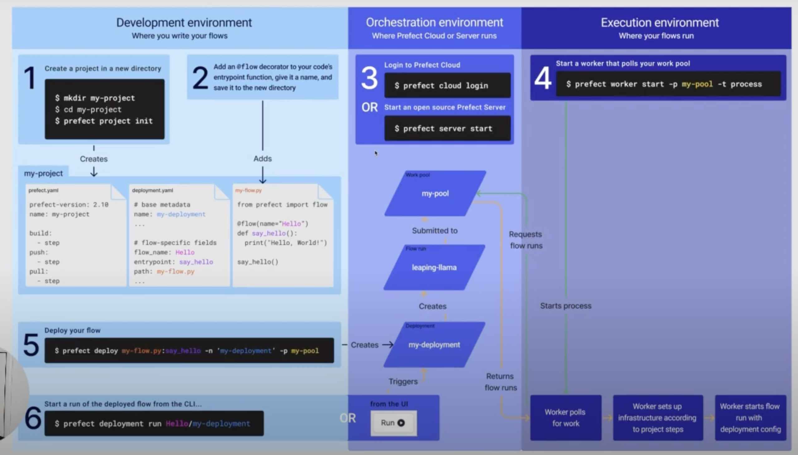

# 03 - ML Pipelines/Workflow Orchestration

#### Example of ML Pipeline


#### Convert notebook to Python script:
```
jupyter nbconvert your_notebook.ipynb --to script
```

## Prefect
Python framework to turn standard pipelines into fault-tolerant dataflows

Self-hosting server component:
- Orchestration API
- Database: stores workflow metadata
- UI

Terminology
- Task: unit of work (using decorator `@task`)
- Flow: container for workflow logic. parent functions to call tasks and define dependencies. (using decorator `@flow`)
- Subflow: flow called by another flow

#### Quickstart
1. Install
```
pip install -U prefect
```
2. Run prefect
```
prefect server start
```
3. Configure Prefect API URL
```
prefect config set PREFECT_API_URL=http://127.0.0.1:4200/api
```

#### How to Deploy



1. Init project
```
prefect init
```
2. Create worker pool via UI or using 
```
prefect worker start --pool "worker pool name>" -t <infra type>
```
3. Deploy the code
```
prefect deploy <script name>:<flow function name> -n <deployment name> -p pool
```
4. Run deployed flow
```
prefect deployment run '<flow function name>/<deployment name>'
```
